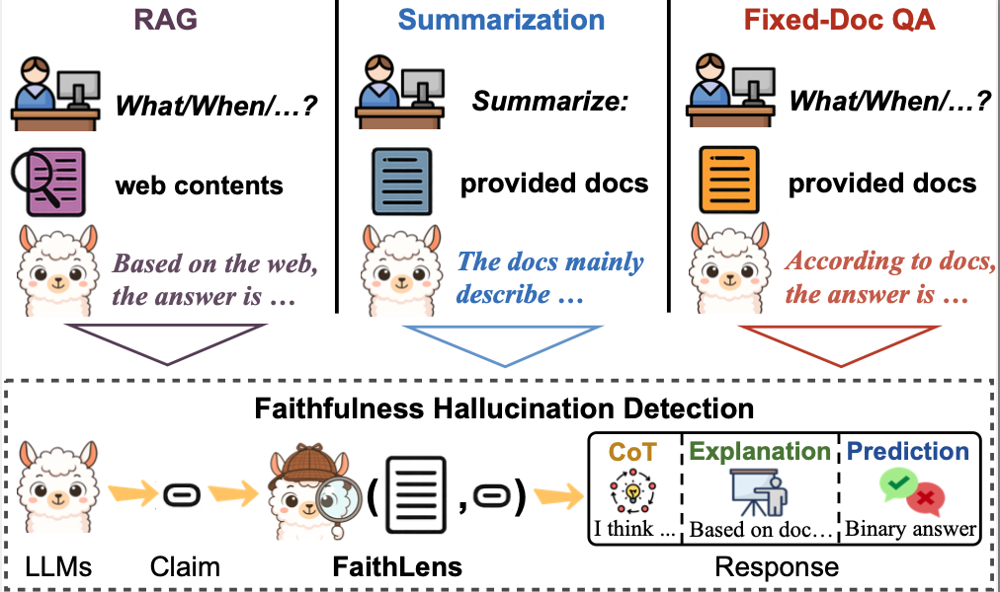
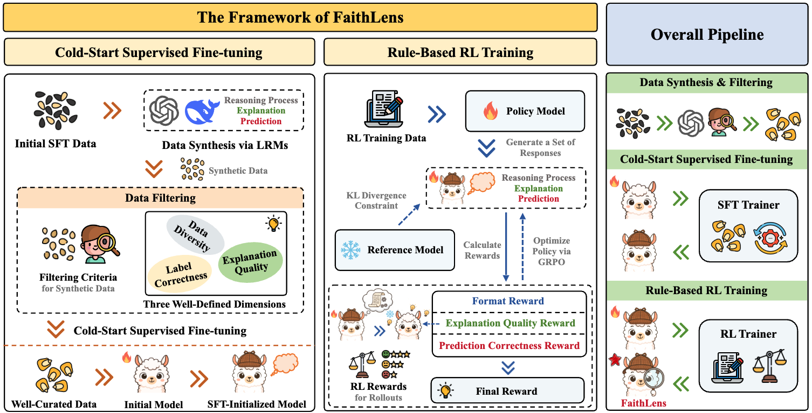

<h1 align="center">FaithLens</h1>

<p align="center">

<a href="https://arxiv.org/abs/XXXX.XXXXX">
</a>

<a href="https://huggingface.co/ssz1111/FaithLens">
    
</a>

<a href="https://huggingface.co/datasets/ssz1111/FaithLens">
    
</a>

</p>

This repository contains the official implementation for **FaithLens**, a cost-efficient and explainable model for **faithfulness hallucination detection**.
<p align="center">
    
</p>


## Abstract
Recognizing whether outputs from large language models (LLMs) contain faithfulness hallucination is crucial for real-world applications, e.g., retrieval-augmented generation and summarization. In this paper, we introduce \textbf{FaithLens}, a cost-efficient and effective faithfulness hallucination detection model that can jointly provide binary predictions and corresponding explanations to improve the trustworthiness. To achieve this, we first synthesize training data with explanations via advanced LLMs and apply a well-defined data filtering strategy to ensure label correctness, explanation quality, and data diversity. Subsequently, we fine-tune the model on these well-curated training data as a cold start and further optimize it with rule-based reinforcement learning, using rewards for both prediction correctness and explanation quality. Results on 12 diverse tasks show that the 8B-parameter FaithLens outperforms advanced models such as GPT-4.1 and o3. Also, FaithLens can produce high-quality explanations, delivering a distinctive balance of trustworthiness, efficiency, and effectiveness.

## Introduction

**FaithLens** is a specialized hallucination detection model that jointly:
1. Predicts whether a claim is **faithful** or **hallucinated** with respect to a given document.
2. Generates **human-readable explanations** to justify its prediction.

FaithLens is trained in two stages:
- **Cold-start SFT** on high-quality synthetic data with explanations.
- **Rule-based RL** to further optimize both prediction accuracy and explanation quality.

Experiments across 12 diverse benchmarks show that FaithLens outperforms advanced LLMs (e.g., GPT-4.1, o3) while maintaining significantly lower inference cost.


## Training

<p align="center">
    
</p>


### Cold-Start Supervised Fine-Tuning (SFT)

In the cold-start SFT stage, we initialize FaithLens with high-quality synthetic data that includes both hallucination labels and corresponding explanations. This stage equips the model with the ability to jointly perform faithfulness hallucination detection and explanation generation.

To run SFT training, execute:

```bash
bash training/sft/train_llama8b_instruct.sh
```

### Rule-Based Reinforcement Learning (RL)

After SFT, FaithLens is further optimized using a rule-based reinforcement learning (RL) stage.
This stage adopts a GRPO-style policy optimization framework and leverages a composite reward consisting of prediction correctness, explanation quality, and output format.

To start RL training, run:

```bash
bash training/verl/rl_training.sh
```

## Detecting and Explaining Faithfulness Hallucination

### Installation

### Usage


## Evaluation

We provide scripts to reproduce the benchmark results reported in the paper, including evaluations on LLM-AggreFact and HoVer.

To run inference and benchmark evaluation, execute:
```bash
bash benchmarks/infer.sh
```

## Environments
We provide separate environments for different stages of the pipeline, as the dependencies required for supervised fine-tuning, reinforcement learning, and evaluation are not identical.

Each stage has its own requirements.txt, located in the corresponding directory.

## Citation
